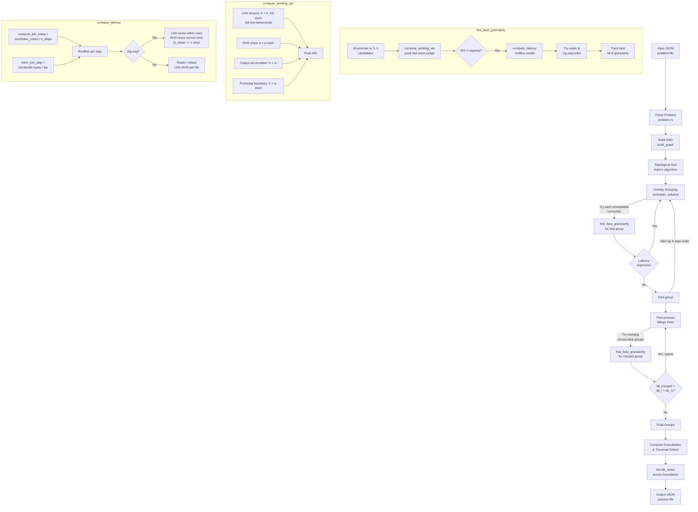
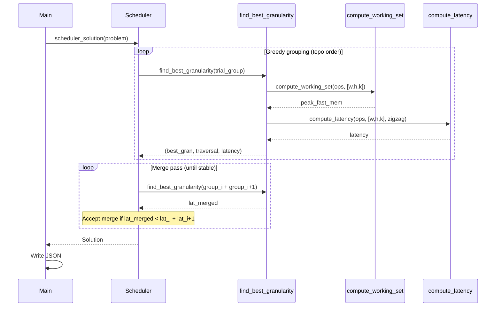

# MLSys 2026 — Scratchpad Scheduler (Track A)

A high-performance, memory-aware ML operator scheduler written in Rust for the [MLSys 2026 Systems Track](https://github.com/yarongmu-google/MLSys). Given a DAG of ML operators (MatMul + Pointwise), it produces a tiled execution schedule that minimizes total latency under a fast-memory (scratchpad) capacity constraint.

---

## Problem Overview

ML accelerators have a two-tier memory hierarchy:

| Tier                     | Capacity      | Bandwidth                         |
| ------------------------ | ------------- | --------------------------------- |
| Fast memory (scratchpad) | Small, finite | Unlimited                         |
| Slow memory (DRAM)       | Infinite      | Limited (`slow_memory_bandwidth`) |

The scheduler must decide:

1. **How to group operators** into subgraphs (fusion)
2. **Tile size `[w, h, k]`** for each subgraph — output width, height, and reduction-step depth
3. **Traversal order** (raster vs. zig-zag snake) for LHS data reuse
4. **Which output tensors to retain** in fast memory across subgraph boundaries

The objective is to minimize `sum(subgraph_latencies)`.

---

## Architecture



### Key Data Flow



---

## Algorithm

### 1. Greedy Subgraph Grouping

Starting from each unscheduled op in topological order, greedily extend the current group by the consumer op that most reduces latency. An op is added only if its inclusion makes the total group latency strictly better than running it separately.

### 2. Post-Process Merge Pass

After the greedy pass, iterate over consecutive group pairs and merge them if the merged latency is lower. Repeat until no merges improve the cost. This handles cases where greedy forward-search gets stuck in a local optimum.

### 3. Granularity Search — `[w, h, k]`

For each candidate tile `[w, h, k]`:

- **Working set check**: `h × K_full` (LHS, fully resident) + `k × w` per RHS strip + `h × w` (accumulator) must fit in `fast_memory_capacity`
- **Latency model** (roofline per k-step):
  - `compute_per_step = sum(base_costs) × native_tiles / k_steps`
  - `mem_per_step = bytes_transferred / slow_memory_bandwidth`
  - `step_latency = max(compute_per_step, mem_per_step)`

### 4. Traversal Orders

| Order               | When beneficial                       | Savings                                                                                               |
| ------------------- | ------------------------------------- | ----------------------------------------------------------------------------------------------------- |
| **Raster**          | Single tile or no LHS reuse           | Baseline                                                                                              |
| **Zig-zag (snake)** | Multiple column tiles (`tiles_w > 1`) | Reload LHS once per row (not per tile); also reuse last RHS across row boundaries when `k_steps == 1` |

### 5. Tensor Retention

After each subgraph, output tensors consumed by the immediately next subgraph are optionally retained in fast memory (skipping the write-back + re-load round-trip), provided they fit alongside the next subgraph's working set.

---

## Project Structure

```
scratchpad-scheduler/
├── data/                    # Benchmark input JSON files
│   ├── example_problem.json
│   ├── mlsys-2026-1.json    # 5 ops, 2s timeout
│   ├── mlsys-2026-5.json    # 19 ops, 5s timeout
│   ├── mlsys-2026-9.json    # 32 ops, 15s timeout
│   ├── mlsys-2026-13.json   # 63 ops, 30s timeout
│   └── mlsys-2026-17.json   # 103 ops, 60s timeout
├── source/
│   ├── Cargo.toml
│   └── src/
│       ├── main.rs          # CLI entry point
│       ├── problem.rs       # Problem struct + JSON deserialization
│       ├── solution.rs      # Solution struct + JSON serialization
│       └── scheduler.rs     # Core scheduling algorithm
├── solutions/               # Generated output JSON files
└── PROBLEM.md               # Official problem specification
```

---

## Build & Run

**Prerequisites:** Rust toolchain (`rustup`, `cargo`)

```bash
cd source
cargo build --release
```

Run on a single benchmark:

```bash
./target/release/mlsys ../data/mlsys-2026-9.json ../solutions/mlsys-2026-9-out.json
```

Run all benchmarks and print latencies:

```bash
for f in example_problem mlsys-2026-1 mlsys-2026-5 mlsys-2026-9 mlsys-2026-13 mlsys-2026-17; do
  ./target/release/mlsys ../data/${f}.json ../solutions/${f}-out.json
  python3 -c "
import json
d = json.load(open('../solutions/${f}-out.json'))
print('${f}: latency={:.1f}, subgraphs={}'.format(sum(d['subgraph_latencies']), len(d['subgraphs'])))
"
done
```

### Build Linux submission binary (cross-compile from macOS)

```bash
# One-time setup
brew install FiloSottile/musl-cross/musl-cross
rustup target add x86_64-unknown-linux-musl

# Build static Linux binary
cargo build --release --target x86_64-unknown-linux-musl
# Output: target/x86_64-unknown-linux-musl/release/mlsys
```

### Package submission zip

```bash
# Run from repo root (source/ is referenced directly — no copy needed)
zip MLSys2026_TrackA_1.zip \
  submission/mlsys \
  submission/writeup.pdf \
  source/Cargo.toml \
  source/src/main.rs \
  source/src/problem.rs \
  source/src/solution.rs \
  source/src/scheduler.rs
```

---

## Results

Measured on Apple M-series (release build):

| Benchmark       | Ops | Total Latency | Subgraphs | Runtime |
| --------------- | --- | ------------- | --------- | ------- |
| example_problem | 2   | 3,276.8       | 1         | ~107ms  |
| mlsys-2026-1    | 5   | 340,787.2     | 1         | ~142ms  |
| mlsys-2026-5    | 19  | 294,737.1     | 1         | ~307ms  |
| mlsys-2026-9    | 32  | 5,558,429.8   | 1         | ~1.2s   |
| mlsys-2026-13   | 63  | 681,574.4     | 17        | ~2.4s   |
| mlsys-2026-17   | 103 | 3,195,200.0   | 56        | ~8.9s   |

All benchmarks complete well within their respective contest timeouts (2s–60s).

---

## Scoring

The contest scores each solution as `min_team_cost / team_cost` per benchmark (higher is better, max = 1.0 per benchmark). Total points are summed across all 25 benchmarks.

See [PROJECT_README.md](PROJECT_README.md) for full contest rules, prizes, and timeline.
